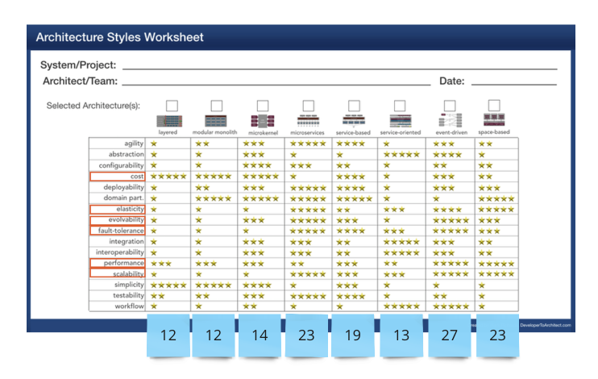

# ADR: Decision on Fundamental Architecture Style

**Status**: Proposed / Accepted

**Date**: 13th September 2023

**Stakeholders**:

- [x] @wschaef
- [x] @uweTelco
- [ ] @slookin
- [ ] @mauermbq

## Context

**Scope**: This decision pertains to the entire Road Warrior system.

**Requirements**:

- **[TR2]** - 2 million active users/week
- **[TR3]** - total users: 15 million (user accounts)
- **[TR5]** - Travel updates must be presented in the app within 5 minutes of generation by the source
- **[TR6]** - Response time from web (800ms) and mobile (First-contentful paint of under 1.4 sec)

In response to the requirements specified by our stakeholders, we have identified a set of critical non-functional requirements (NFRs). Before delving into the architecture design phase, it is imperative that we reach a consensus on the fundamental architectural style for our system. This decision carries significant weight, as altering it later in the process can prove to be costly. Therefore, it is the first decision we are making.

To facilitate this decision-making process, we are leveraging an "Architecture Styles Worksheet" introduced by Mark Richards, available at https://www.developertoarchitect.com/resources.html. We have identified and prioritized the key architecture characteristics that align with the NFRs and have assigned scores to each architecture style.

Based on the computed scores, three potential candidates have emerged:

- **Microservices** [Score: 23]
- **Event-driven** [Score: 27]
- **Space-based** [Score: 23]

## Decision

We have decided to adopt a combination of **Microservices** for the synchronous part of the system and **Event-driven** for the asynchronous part of the system.

We have excluded the **Space-based** architecture style due to the added parameter of **simplicity**. In our experience, simplicity significantly influences maintainability, time to market, and availability.

**Event-driven** is an excellent choice when external triggers necessitate changes. In our system, it seamlessly integrates into the integration component. Conversely, **Event-driven** introduces complexity that is unnecessary for frontends and analytics. In these areas, a straightforward request/response pattern suffices, making **Microservices** the suitable choice.

## Consequences

This decision comes with the responsibility of finding effective solutions for distributed authorization, monitoring, and traceability.
